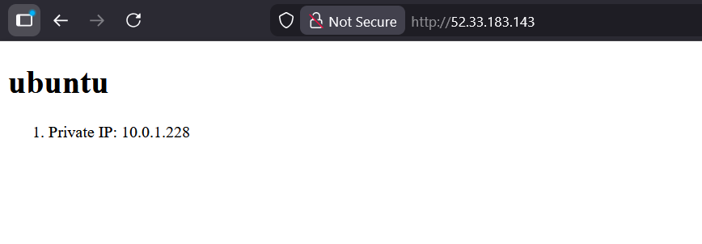

# 4640-ansible-roles-lab


## Requiements
install on the control node:  
- python >= 3.6
- boto3 >= 1.34.0
- botocore >= 1.34.0  

## Terraform
Initialize Terraform
```
terraform init
```
Apply the configuration to create servers
```
terraform apply
```
## Run Ansible Configuration
Test the playbook syntax
```
cd ansible
ansible-playbook --syntax-check playbook.yml
```
Run the playbook
```
ansible-playbook playbook.yml
```


